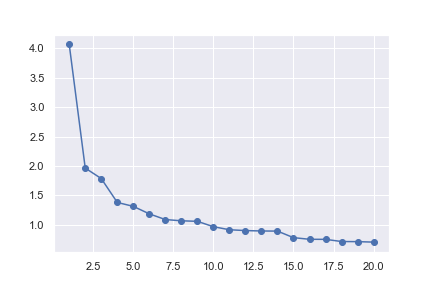

[toc]

# 建模笔记

## 层次分析

==解决评价类问题==，可用打分解决，因素`<->`权重

|           | 指标权重 | 方案1 | 方案2 | ... |
| --------- | -------- | ----- | ----- | --- |
| **指标1** |          |       |       |     |
| **指标2** |          |       |       |     |
| **...**   |          |       |       |     |
|           |          |       |       |     |

$\sum w_i=1$，同一指标各方案权重和为1


#### 用分治法考虑指标权重

指标两两比较，最后形成完整的权重；

```pseudocode
function Compare(A, B): /*A，B为两指标*/
if Compare(B, A)已知:
	return 1/Compare(B, A)
elseif A和B同等重要:
	return 1
elseif A比B稍微重要：
	return 3
elseif A比B明显重要：
	return 5
elseif A比B强烈重要：
	return 7
elseif A比B极端重要：
	return 9
```

|           | 指标1 | 指标2 | 指标3 |
| --------- | ----- | ----- | ----- |
| **指标**1 | 1     | 2     | 5     |
| **指标**2 | 1/2   | 1     | 1/4   |
| **指标**3 | 1/5   | 4     | 1     |

判断矩阵中$A_{ij}$就是$i$相对于$j$的重要程度，同样可以有：

| 指标X     | 方案1     | 方案2 |
| --------- | --------- | ----- |
| **方案1** | 1         | 3     |
| **方案2** | $\frac13$ | 1     |

此时存在矛盾现象（不一致）

应总有：
$$
a_{ij}a_{jk}=a_{ik}\leftrightarrow 各行各列成比例\leftrightarrow A是一致矩阵\leftrightarrow rank(A)=1,\lambda_1=tr(A)=n,\lambda_i=0(i>1)
$$
一致性指标：$CI=\dfrac{\lambda_{max}-n}{n-1}$，平均随机一致性指标$RI$（查表），判断矩阵的一致性比例$CR=\dfrac{CI}{RI}<0.1$才可以接受，否则要修正。

对于不一致的判断矩阵，不能只对第一列归一化，而是分别计算各列的权重，并将对应算术(==或集合==)平均作为真实权重：
$$
\omega_i=\dfrac1n\sum_{j=1}^n\dfrac{a_{ij}}{\sum_{k=1}^na_{kj}},i=1,2,\cdots,n
$$
**特征值法**：求最大特征值对应的特征向量进行归一化就是各项权重（使用最多）

## 优劣解距离法(TOPSIS)

若只有一个指标：构造计算评分的公式：
$$
f(x)=\dfrac{x-min}{max-min}
$$
指标分为极大型指标（效益性指标）和极小型指标（成本性指标）；对极小型指标要进行==指标正向化==：
$$
f(x)=max-x
$$
量纲不同需要标准化处理：$n$个要评价的对象，$m$个指标（已经正向化）
$$
X=\begin{bmatrix}
x_{11}&x_{12}&\cdots x_{1m}\\
x_{21}&\cdots\\
\vdots\\
x_{n1}
\end{bmatrix}\longrightarrow Z:z_{ij}=\dfrac{x_{ij}}{\sqrt{\sum_{i=1}^nx_{ij}^2}}
$$

```matlab
matlab : repmat函数
```

若$Z$是已经标准化处理后的数据矩阵：定义第$i$个评价对象与最大值的距离：

```matlab
D_max = norm(Z(i) - max(Z))
```

最小值类似：

```matlab
D_min = norm(Z(i) - min(Z))
```

从而有未归一化的得分：$S_i=\dfrac{D_{min}}{D_{max}+D_{min}}$

事实上还有两种指标：中间型指标(PH值)，区间型指标(体温)

中间型指标正向化：
$$
M=max\{|x_i-x_{best}|\},\tilde{x}_i=1-\dfrac{|x_i-x_{best}|}{M}
$$
区间型指标正向化：最佳区间为$[a,b]$:
$$
M=\max\{a-\min\{x_i\},\max\{x_i\}-b\}\\
\tilde x_i=
\begin{cases}
1-\dfrac{a-x}{M},x<a  \\
1,a\le x\le b\\
1-\dfrac{x-b}M,x>b
\end{cases}
$$
步骤：正向化$\to$标准化$\to$计算得分并归一化

#### 基于熵权法对`Topsis`模型的修正

熵权法是一种客观赋权的方法，依据的原理：==指标的变异程度越小，所反映的信息量就越少，其对应的权值也应该越低。==（客观=数据本身就可以告诉我们权重）

> 越有可能发生的事情，信息量月少；反之信息量越多

信息熵：$x$为事情发生的情况，$p(x)$为概率，定义
$$
\begin{aligned}
I(x)&=-\ln(p(x))\\
H(x)&=\sum_{i=1}^n[p(x_i)I(x_i)]=-\sum_{i=1}^n[p(x_i)\ln p(x_i)]
\end{aligned}
$$
信息熵是对信息量的期望值。信息熵越大，<u>已知</u>信息量越小

计算方法：给定已正向化矩阵$X_{n\times m}$，标准化后为$Z$，再计算概率矩阵$P$:
$$
p_{ij}=\dfrac{z_{ij}}{\sum_{i=1}^n z_{ij}}
$$
再算信息熵和信息效用值：对第$j$个指标而言，其信息熵计算公式为：
$$
e_j=-\dfrac1{\ln n}\sum_{i=1}^np_{ij}\ln(p_{ij}),j=1,2,\cdots,m\\
信息效用值d_j=1-e_j
$$
将信息效用值归一化，得到每个指标的熵权：$W_j=d_j/\sum d$

## 插值算法

1. 分段多项式作为插值函数：分段差值；
2. 一个多项式插值：多项式插值；
3. $P(x)$是三角多项式：三角插值（很少用）

**定理**：$n+1$个互不相同的节点存在唯一$n$次多项式插值。

**$Runge$现象**：高次插值产生极大波动和明显震荡，所以不应轻易使用高次插值

分段低次插值可以提高插值精度（分段线性插值，分段二次插值）

牛顿插值、拉格朗日插值都存在龙格现象，因此用得少；

埃尔米特插值：具有节点的导数值约束的插值. In matlab : `y_new = pchip(x, y, x_new)`

三次样条插值：更加严格插值:MATLAB `p = spline(x, y, new_x)`

#### $n$维数据的插值

优先使用`spline`: `p = interpn(x, y, x_new, 'spline')`

## 拟合算法

最小二乘法公式：
$$
\hat k=\dfrac{n\sum x_iy_i-\sum y\sum x}{n\sum x^2-\sum x\sum x}\\
\hat b=\dfrac{\sum x^2\sum y-\sum x\sum xy}{n\sum x^2-\sum x\sum x}
$$
判断拟合好坏：

1. 总体平方和$SST$：$SST=\sum_{i=1}^n(y_i-\bar y)^2$

2. 误差平方和$SSE$：$SSE=\sum_{i=1}^n(y_i-\hat y_i)^2$

3. 回归平方和$SSR$：$SSR=\sum_{i=1}^n(\hat y_i-\bar y)^2$
我们有:
$$
SST=SSE+SSR
$$
4. 拟合优度：$0\le R^2=\dfrac{SSR}{SST}=\dfrac{SST-SSE}{SST}\le 1$

$R^2$越接近1，拟合越好，==$R^2$只能用于拟合函数是线性函数的时候==，线性函数和其他非线性函数比较拟合好坏可以直接看$SSE$

==此处的线性函数为对参数为线性（线性于参数）==，比如$y=a_1+a_2x+a_3x^2,y=e^{a_1+a_2x},y=a_1+a_2x+a_3x^2+a_4x^3$.

非线性：$y=a+b^3x,y=a+bx+bcx^2,y=a(x-b)^2,y=a\sin(b+cx)$，都不能用$R^2$

## 相关系数

总体协方差：
$$
Cov(X,Y)=\dfrac{\sum_{i=1}^n(X_i-E(X))(Y_i-E(Y))}n
$$
==协方差的大小和两个变量的量纲有关，不适合作比较==，因此规范化：
$$
\rho_{XY}=\dfrac{Cov(X,Y)}{\sigma_X\sigma_Y}=\dfrac1n\sum_{i=1}^n\dfrac{X_i-E(X)}{\sigma_X}\dfrac{Y_i-E(Y)}{\sigma_Y}
$$
总体皮尔逊相关系数是标准化后的协方差。

样本协方差：
$$
Cov(X,Y)=\dfrac{\sum_{i=1}^n(X_i-E(X))(Y_i-E(Y))}{n-1}
$$
样本皮尔逊相关系数:
$$
r_{XY}=\dfrac{Cov(X,Y)}{S_XS_Y}
$$
误区：皮尔逊系数是衡量两随机变量线性相关的程度，而非线性关系也能导致线性相关系数很大。

相关系数会受到异常值的影响。 

<u>对数据进行描述性统计</u>是好的统计习惯，SPSS上操作：`分析->描述统计->描述`

`图形->旧对话框->散点图->矩阵散点图`刻画出两两变量的联系。

#### 皮尔逊相关系数假设检验

构造统计量：
$$
t=r\sqrt{\dfrac{n-2}{1-r^2}}
$$
自由度为$n-2$的$t$分布，然后找接受域和拒绝域；

显著性标记：$P<0.01$标三颗星，$P>0.01 \&P<0.05$标两个星，$P<0.1\&P>0.05$标一颗星

在$SPSS$中：`分析->相关->双变量->标记显著相关性`

皮尔逊相关系数假设检验的条件：实验数据来自正态分布的总体，实验数据差距不能太大，抽样独立。

#### 检验正态分布

##### JB检验(n大于30)

构造JB统计量:
$$
JB=\dfrac n6[S^2+\dfrac{(K-3)^2}{4}]\sim\chi(2)
$$
$S$是偏度(`skewness`)，$K$是峰度`kurtosis`：
$$
S=E[(\dfrac{X-\mu}{\sigma})^3]\\K=E[(\dfrac{X-\mu}{\sigma})^4](-3)
$$
对$JB$假设检验得到检验值$JB^*$，计算其$p$值，如果$<0.05$则拒绝原假设。

```matlab
[h, p] = jbtest(data(:, 1), 0.05) 
% 检验第一列数据是否为正态分布，h=1则拒绝原假设，=0则接受，0.05表示显著性水平
```

##### 夏丕罗-威尔克检验(小样本)

$SPSS$:`分析->描述统计->探索->图->含检验的正态图`

##### Q-Q图

判断近似正态分布`<->`Q-Q图上的点近似一条直线。matlab里用`qqplot(data)`

## 斯皮尔曼相关系数

定义：
$$
r_s=1-\dfrac{6\sum_{i=1}^n d_i^2}{n(n^2-1)}\in[-1,1]
$$
其中$d_i$为$X_i$和$Y_i$之间的等级差（等级差即序数差，如果序列存在相同数字，则取算数平均）

**斯皮尔曼相关系数被定义成等级之间的皮尔逊相关系数**

```matlab
corr(X, Y, 'type', 'Spearman') # 必须是列向量
corr(X, 'type', 'Spearman')
```

#### 斯皮尔曼假设检验

对于小样本，样本相关系数$r$必须$\ge$表中临界值，才能得到显著结论，通常是双侧检验，显著水平0.05；

对于大样本，统计量
$$
r_s\sqrt{n-1}\sim\mathcal N(0,1)
$$
计算这个统计量，并求出对应$p$值与0.05相比：

```matlab
z = r * sqrt(n - 1)
p = 1 - normcdf(x) * 2
if p > 0.05
	接受假设
else
	拒绝假设
end
```

或者直接：

```matlab
[R, P] = corr(X, 'type', 'Spearman')
```

#### 如何选择相关系数？

1. 连续数据，正态分布，线性关系用皮尔逊;
2. 上述任一条件不满足，就用$Spearman$;
3. 两个<u>定序</u>数据只能用皮尔逊（定序数据表示数据反应对象等级，比如优、良、差对应0，1，2）.

## 典型相关分析

思想与主成分分析相似：

1. 在每组变量中找到线性组合，使得两组的线性组合之间有最大的相关系数；
2. 然后选取和最初挑选的这对线性组合不相关的线性组合，使其配对，并选取相关系数最大的一对；
3. 如此继续，直到两组变量的相关性被提取完毕为止
4. 被选出的线性组合配对成为典型变量，他们的相关系数被称为典型相关系数

假设2组变量：
$$
X^{(1)}=(X_1^{(1)},X_2^{(1)},\cdots,X_p^{(1)}),X^{(2)}=(X_1^{(2)},X_2^{(2)},\cdots,X_q^{(2)})
$$
分别在两组变量中选取若干有代表性的综合变量$U_i,V_i$,使得每一个综合变量是原变量的线性组合：
$$
U_i=\sum_{j=1}^pa_j^{(i)}X_j^{(1)}=\bold a^{(i)'}\bold X^{(1)}\\
V_i=\sum_{j=1}^qb_j^{(i)}X_j^{(2)}=\bold b^{(i)'}\bold X^{(2)}
$$
组数不确定，如果第一组理想就可停止，如果需要找第二组，为了使第二组更有效，则要有：
$$
Cov(U_1,U_2)=Cov(V_1,V_2)=0
$$

#### 求第一组

第一组要求：
$$
\mathop{\arg\max}_{\bold a^{(1)},\bold b^{(1)}} \;\rho(U_1,V_1)\quad s.t.\;Var(U_1)=Var(V_1)=1
$$
(反差为1是为了消除量纲影响)

$D(U)=D(a'X^{(1)})=a'Cov(X^{(1)},X^{(1)})a=a'\Sigma_{11}a=1$
$D(V)=D(b'X^{(2)})=b'Cov(X^{(2)},X^{(2)})b=b'\Sigma_{22}b=1$
$Cov(U,V)=a'\Sigma_{12}b$
$Corr(U,V)=\dfrac{Cov(U,V)}{\sqrt{D(U)}\sqrt{D(V)}}=\dfrac{a'\Sigma_{12}b}{\sqrt{a'\Sigma_{11}a}\sqrt{b'\Sigma_{22}b}}$

我们需要极大化$Corr(U,V)$
我们有：
$$
A=\Sigma_{11}^{-1}\Sigma_{12}\Sigma_{22}^{-1}\Sigma_{21}\\
B=\Sigma_{22}^{-1}\Sigma_{21}\Sigma_{11}^{-1}\Sigma_{12}
$$
设$A$和$B$的非零特征根为$\lambda_1^2\ge\lambda_2^2\ge\cdots\ge\lambda_r^2$:
$$
a^{(1)},a^{(2)},\cdots,a^{(r)}为A对应于\lambda_1^2,...，\lambda_r^2的特征向量\\
b^{(1)},b^{(2)},\cdots,b^{(r)}为B对应于\lambda_1^2,...，\lambda_r^2的特征向量
$$
最大特征根的平方根$\lambda_1$即为两典型变量的相关系数，第一典型相关系数；

#### 求第二组

加上限制：$Cov(U_1,U_2)=0,Cov(V_1,V_2)=0$，结论在上面；

实际上需要用样本估计出矩阵$\hat A,\hat B$来估计$A$,$B$;

若样本已经过标准化处理，则样本协方差矩阵就是相关系数矩阵；

#### 典型相关系数的显著性检验

检验两组变量相关性：

假设$H_0:\Sigma_{12}=0$；构造统计量
$$
Q_0=-m\ln\Lambda_0\sim\chi^2(f),其中m=(n-1)-\frac12(p+q+1),f=pq,\Lambda_0=\prod_{i=1}^{\min(p,q)}(1-\hat\lambda_i^2)
$$
检验典型相关系数：
$H_0:\lambda_{k+1}=\lambda_{k+2}=...=\lambda_r=0$

构造统计量:
$$
Q_k=-m_k\ln\Lambda_{k}\sim\chi^2(f_k),fk=(p-k)(q-k),m_k=(n-k-1)-\frac12(p+q+1) \\
\Lambda_{k}=\prod_{i=k+1}^r(1-\hat\lambda_i^2)
$$
只对不为0的典型变量对进行分析。

#### 在SPSS中计算典型相关系数

`分析->相关->典型相关性->分拆指标`

其中的显著性就是$p$值；标准化典型相关系数应该是对应的线性组合系数；

MATLAB中：`[A,B,r,U,V,stats]=canoncorr(X,Y);`

从相关矩阵出发计算典型相关：必须对数据进行标准化变换处理，然后再做典型相关分析；

#### 典型载荷分析

原始变量和典型变量之间的相关性分析；

#### 典型冗余分析

计算典型变量解释的方差比例，也就是解释力.

#### 步骤总结

1. 数据分布有假设：两组数据服从联合正态分布；
2. 对两组变量的相关性进行检验（构造似然统计量）；
3. 确定典型相关变量的个数（看p值）；
4. 利用标准化后的典型相关变量分析问题；
5. 进行典型荷载分析；
6. 计算贡献（冗余分析）

## 回归分析

关键词：相关性，$X$，$Y$：

1. 相关性不代表因果性；
2. Y是因变量，实际应用中往往是核心变量，包括连续数值型，0-1型，定序，计数，生存变量；
3. X是自变量

回归分析的任务：

1. 识别和判断那些$X$变量和$Y$真正相关；
2. 这些真的相关的$X$变量同$Y$是正相关还是负相关；
3. 赋予不同$X$不同权重，即回归系数（相对重要性）。

数据的分类：

1. 横截面数据：问卷，GDP，考试分数；
2. 时间序列数据：同一个对象不同时间考察，出生到现在的体重，历年GDP，每隔一小时的温度；
3. 面板数据：上2种数据综合，2008-2018，各省GDP数据。

### 线性回归

#### 一元线性回归

类似于直线拟合问题：

回归模型:假设$x$是自变量，$y$是因变量，且满足：
$$
y_i=\beta_0+\beta_1x_i+\mu_i
$$
$\bold\beta$为回归系数，$\mu$为无法观测且满足一定条件的扰动项。令预测值
$$
\hat{y_i}=\hat\beta_0+\hat\beta_1x_i
$$
优化问题：
$$
\vec{\hat\beta}=\mathop{\arg\min}_{\vec\beta}(\sum_{i=1}^n(\hat\mu_i)^2)
$$
我们称
$$
\hat\mu_i=y_i-\hat\beta_0-\hat\beta_1x_i
$$
为残差；
对线性的理解：如下函数也可以转换成线性模型：
$$
y=\beta_0+\beta_1\ln x+\mu_i\\
\ln y_i=\beta_0+\beta_1\ln x +\mu_i\\
y=\beta_0+\beta_1x_i+\beta_2x_i^2+\mu_i\\
y=ax_{1i}+bx_{2i}+cx_{1i}x_{2i}
$$
<u>使用线性回归建模之前，需要对数据进行预处理</u>（In EXCEL,MATLAB or STAT）

##### 内生性

假设模型为
$$
y=\vec\beta'\vec x+\mu
$$
其中$\mu$扰动项与$\vec x$都不想关，则称该模型具有外生性；否则具有内生性(估计不准确，不满足无偏性和一致性)

用$\mu$和$x$的相关系数来衡量内生性:[一个蒙特卡洛模拟](endogenous.m)

但外生性要求过高，因此弱化条件，将解释变量分为核心解释变量与控制变量：

1. 核心解释变量：感兴趣的变量，需要保证外生性；
2. 控制变量：对这些变量无很大兴趣，但也要放入回归方程；

实际应用中只需要保证核心解释变量和$u$不相关。

##### 回归系数的解释

$$
\hat\beta_m=\dfrac{\part y_i}{\part x_{mi}}
$$

也称作“偏回归系数”；

而对于$y=a+b\ln x+c$，取对数场景，取对数意味着弹性，百分比，取对数经验法则：

1. 与市场价值相关；
2. 以年度相关的变量；
3. 比例变量；
4. 变量取值非负数，包含0则取$\ln(x+1)$。

##### 四类模型回归系数模型

1. $y=a+bx+u$;
2. $\ln y=a+b\ln x+c$:$x增加1\%,y平均变化b\%$;
3. $y=a+b\ln x$：$x$每增加1%，y平均变化$b/100$个单位；
4. $\ln y=a+bx$:$x每增加1个单位，y平均变化(100b)\%$

##### 特殊的自变量：虚拟变量

自变量存在定性变量，例如性别，地域：引入虚拟变量，从而转为定量，例如用$1$表示为男生，$0$表示为女性（以对照组为0，作为参照），虚拟变量前的系数表示某虚拟变量同参照的平均差异；

<u>为了避免完全多重共线性的影响，引入虚拟变量的个数一般为分类个数-1</u>

##### 含交互项的自变量

$$
y=a+bx_1+cx_2+dx_1x_2+e\\
\dfrac{\mathrm dy}{\mathrm dx_1}=b+dx_2：x_2越大，x_1增加效应越大
$$

##### 调整后的拟合优度

$$
R^2=1-\dfrac{SSE}{SST}\\
R_{adj}^2=1-\dfrac{SSE/(n-k-1)}{SST/(n-1)},其中k为自变量个数
$$

回归分为解释性回归和预测性回归，预测性回归会更看重$R^2$，解释性回归更关注模型整体的显著性以及自变量的统计显著性和经济意义显著性；

若$R^2$过低：①调整数据，如取对数或平方后在回归；②删除异常值数据；

##### 标准化回归

目的：剔除量纲的影响；

方法：对数据进行标准化；

好处：标准化回归系数绝对值越大，说明影响越大；

### 异方差

#### 扰动项要满足的条件

球形扰动项：同方差，无自相关
$$
\mu=
\begin{bmatrix}
\mu_1\\\mu_2\\\vdots\\\mu_n
\end{bmatrix},Var(\mu|X)=\sigma^2I_n=\Sigma\\
\Sigma_{ij}=Cov(\mu_i,\mu_j)
$$
若存在异方差问题：

1. $OLS$的回归系数是无偏，一致的；
2. 假设检验无法使用（构造的统计量失效）；
3. $OLS$估计量不再是最优线性无偏估计量。


#### 检验异方差

1. 残差与拟合值散点图`rvfplot`中，随着拟合值增大，残差波动越大；
2. 残差与自变量$x$的散点图`rvpplot x`中，$x$小的时候波动大；

#### 拟合值出现负数的原因

数据的分布不均匀；

#### 异方差的假设检验（总是要写）

1. $BP$检验
2. 怀特检验（推荐）

#### 解决

1. 使用$OLS+$稳健的标准误:

   `regress y x1 x2 ... xk, robust`

2. 广义最小而成$GLS$，原理：方差小的数据包含的信息多，我们可以给予信息量大的数据更大权重；

### 多重共线性

因为最小二乘的解析解：
$$
\beta=(X'X)^{-1}X^\top Y
$$
若$X$不是列满秩的，那么$(X'X)^{-1}$不存在，“严格/完全多重共线性”；

更常见的是“近似多重共线性”；使得$X'X$变得几乎不可逆，$(X'X)^{-1}$行列式变得很大，致使方差$Var(b|X)=\sigma^2(X'X)^{-1}$增大，使得估计不准确。

症状：虽然$R^2$大，联合显著性检验也很显著，但单个系数的$t$检验不显著，或者系统估计值不合理；甚至符号与预期相反；

#### 检验多重共线性

方差膨胀因子$VIF$，假设现在有$k$个自变量，那么第$m$个自变量的$VIF_m=\dfrac{1}{1-R^2_{1\sim k\backslash m}}$

$R^2_{1\sim k\backslash m}$表示将第$m$个自变量作为因变量，对剩下$k-1$个自变量回归得到的拟合优度；

方差膨胀因子越大，说明该变量与其他变量相关性越大。定义
$$
VIM=\max\{VIM_1,VIM_2,\cdots,VIM_k\}
$$
若$VIM>10$则有严重的多重共线性。

<u>预测回归不必理会多重共线性</u>

### 逐步回归分析

分为向前/向后逐步回归；
In STATA:`stepwise regress y x1 x2 ...xk, pe(#1)/pr(#2)`, #1和#2表示显著性水平$\alpha$;
==$x_1,x_2,...,x_k$之间不能有完全多重共线性==；逐步回归不能像普通回归那样剔除完全多重共线性；

1. 两种逐步回归结果会有差别
2. 不轻易使用逐步回归，因为可能产生内生性问题；
3. 每种情况都考虑一次($\sum_{i=1}^kC_k^i=2^k-1$)是一种计算费时但优秀的筛选方法.

## 图论

[绘图网站](https://csacademy.com/app/graph_editor/)

[MATLAB中绘图语法](Graph.m)

[MATLAB求解最短路径](ShortestPath.m)

找到给定范围内所有的点:

```matlab
[nodeIDs, dist] = nearest(G, s, d);
```

## 分类模型

数据预处理：生成虚拟变量

`SPSS:转换->创建虚变量->输入根名称->清除冗余列`

预测值$\hat y$是概率；

#### 线性概率模型

$y_i=x_i'\beta+\mu_i$

内生性问题：$y_i$只能为0 or 1，
$$
u_i=
\begin{cases}
1-x_i'\beta,\;y_i=1\\
-x_i'\beta,\;\quad y_i=0
\end{cases}
$$
显然$Cov(x_i,u_i)\neq 0$

而且预测值存在大于1或小于0的可能；

我们需要找值域为$[0,1]$的函数：

1. $$
   F(x,\beta)=\Phi(x_i'\beta)=\int_{0}^{x_i'\beta}\dfrac{1}{\sqrt{2\pi}}e^{-t^2/2}\mathrm dt(probit回归)
   $$

2. $$
   F(x,\beta)=S(x_i'\beta)=\dfrac{\exp(x_i'\beta)}{1+\exp(x_i'\beta)}(logistic回归)
   $$

显然后者比前者更方便；

求解方法：非线性模型，用极大似然估计($MLE$)求出$\hat\beta$

##### SPSS求解逻辑回归

`分析->回归->二元Logistic->方法是逐步回归->保存，勾上概率和组成员`

假如自变量中有分类变量：

1. 创建虚拟变量，然后删除任意一列以排除完全共线性的影响；
2. 直接点击分类，然后定义分类协变量，SPSS帮我们自动生成(推荐)。

假如预测效果差：增加平方项和交互项；

“过拟合现象”：为消除偶然性，交叉验证；

#### Fisher线性判别分析

思想：找到能分割两集合的超平面$w^\top x=0$（等价于找到一个直线$y=w^\top x$，将点投影到直线上，同类点的投影尽可能近，异类点投影尽可能远）

##### SPSS 

`分析->分类->判别式->选择变量->定义范围->统计->勾选费谢尔，未标准化->分类勾上摘要表->确认`

其中<u>典则判别函数系数</u>就是线性系数向量$w$；<u>分类函数系数</u>为贝叶斯判别函数系数表，将数据带入，哪个函数值大就归为哪一类；

#### 多分类

Fisher也可以用于多分类，只需要改变定义范围即可（即找多个平面）；

逻辑回归也可推广多分类，只需要将$Sigmoid$函数推广至$Softmax$函数；

`SPSS: 分析->回归->多元回归`

## 聚类模型

将样本划分为由类似对象组成的多个类的过程；

### K-means聚类算法

1. 指定需要划分的簇数$k$;

2. 随机选择$k$个数据对象作为初始的聚类中心（也可以不是样本点）

3. 计算各点到着$k$个聚类中心的距离，将点归类为距离最短的聚类中心对应的类

4. 调整新类并重新计算中心

5. 循环第三，四步直到收敛或者达到指定迭代步数

6. 程序结束

[可视化网站](https://www.naftaliharris.com/blog/visualizing-k-means-clustering/)

推荐画流程图，防止查重

缺点：

1. 要求用户先给出$k$;

2. 对初始值敏感；

3. 对鼓励点数据敏感

### K-means++算法

1. 随机选一个样本作为第一个聚类中心

2. 计算每个样本与当前已有聚类中心的最小距离，这个值越大，表示被选取作为聚类中心的概率越大；最后用轮盘法选出下一个聚类中心，假设$i$为中心，$p_j$表示$j$点为下一个中心的概率:
$$
p_j=\dfrac{d_{ij}}{\sum_{i\neq k}^n d_{ik}}
$$

3. 重复步骤2，直到选出$K$个聚类中心。选出初始点之后，再调用$K-means$算法

### SPSS实现K-means算法

`分析->分类->K均值聚类->保存->全部勾选->选项->勾选每个个案的聚类信息`

[分类结果](k-mean-iris.spv)

### 讨论

1. $K$的取值如何决定？——自己看；

2. 数据量纲问题，会导致“距离”没有意义——标准化:
`分析->描述统计->描述->将标准化值另存为变量`
$$
z_i=\dfrac{x_i-\bar x}{\sigma_x}
$$

### 系统层次聚类

常用样本距离：

1. 绝对值距离(1-范数)；

2. 欧氏距离(2-范数)；

3. 闵可夫斯基距离(q范数)；

4. 切比雪夫距离($\infty$范数);

5. 马氏距离:$d(x,y)=(x-y)'\Sigma^{-1}(x-y)$

常用指标距离(用于指标的分类):

1. 相关系数$\rho$;

2. 夹角余弦$r$;

常用类间距:

1. 最短距离：两类中最近点距离；

2. 最长距离；

3. 组间平均连接法：

4. 组内平均连接法；

5. 重心法；

系统聚类流程：

1. 计算$n$个样本两两间距$d_{ij}$

2. 构造$n$各类；

3. 合并距离最近的两类为一新类；

4. 计算新类与当前各类距离

5. 类的个数若不为1，返回第三步；否则继续；

6. 画聚类图(树状图)，决定分类个数和类；

#### SPSS实现系统聚类

[SPSS实现结果](system-cluster-iris.spv)

### 肘部法则

通过图形$(J-K曲线)$大致估计最优聚类数量；

各个类畸变程度之和：该类重心与内部成员位置距离的平方和；
$$
\begin{aligned}
第k个类的畸变程度：&\sum_{i\in C_{k}}|x_i-u_k|^2\\
所有k类的畸变程度：&J=\sum_{k=1}^K\sum_{i\in C_k}|x_i-u_k|^2
\end{aligned}
$$
$J$也被成为聚合系数，显然$J(n)=0$，图像转折点就是最优类别数；

画图：选择[SPSS实现结果](system-cluster-iris.spv)中的“集中计划”的“系数”列，该列从后往前就是肘部图:



从3开始下降趋缓，所以选择分为三类；

当指标个数为2，3时，可以画出聚类示意图：


```python
import pandas as pd
import numpy as np
import seaborn as sns
import matplotlib.pyplot as plt
from mpl_toolkits.mplot3d import Axes3D

data = pd.read_excel('iris.xlsx').drop(axis=1, columns='Unnamed: 0')

fig = plt.figure()
ax = fig.add_subplot(111, projection='3d')
x, y, z = data['petal_length'], data['sepal_length'], data['sepal_width']

ax.set_xlabel("petal_length")
ax.set_ylabel("sepal_length")
ax.set_zlabel("sepal_width")

ax.scatter(x, y, z, c=data.species)

plt.savefig('iris_species_scatter.png')
```


### DBSCAN算法

全称：具有噪声的基于密度的聚类方法（之前算法是基于距离的）

算法将点分为三类：

1. 核心点，在半径$\epsilon$内含有超过$MinPts$的点；
   
2. 边界点，在半径$\epsilon$内点的数量小于$MinPts$，但落在核心点的邻域内；

3. 噪音点，既不是核心也不是边界的点。

建议：先看，如果形状很'DBSCAN'且只有两个指标，那就用DBSACAN；其余情况就系统聚类；

## 时间序列分析

时间序列数据：对同一对象在不同时间连续观察得到的数据；

构成：时间要素和数值要素；

可分为时期时间序列和时点时间序列；

时期时间序列可加，时点时间序列不可加；

### 时间序列分解

一般情况下，时间序列的数值变化规律有以下四种：

1. 长期变动趋势：相当长时间内持续增长或下降；

2. 季节变动趋势：季节周期性变化，[百度指数](http://index.baidu.com/v2/index.html#/)

3. 循环变动趋势，以若干年为一周期；

4. 不规则变动趋势。

### 叠加模型和乘积模型

1. 四种变动相互独立：$Y=T+S+C+I$;

2. 四种变动存在相互影响：$Y=T\times S\times C\times I$

如果数据随着时间的推移，序列的季节波动越来越大，建议使用乘积模型，若波动保持稳定，则可直接使用叠加模型；

### SPSS进行时间序列分析

定义时间变量：`数据->定义日期和时间->对应时间->确定`

画时序图：`分析->时间序列预测->序列图->将时间轴标签设为时间变量->确定`

季节性分解：`选择加法或者乘法模型->移动平均值权重：周期是奇数是选所有点相等，偶数选按0.05加权`

加法模型分解生成四个变量：

1. ERR:不规则变动I

2. SAS:季节性调整后序系列：$T+C+I$

3. SAF:季节因子：$S$

4. STC:趋势循环成分：$T+C$

加法季节因子和为0，乘法季节因子是百分比，所以四个季节因子的积是$1(100\%)$

步骤：

1. 作时间序列图

2. 判断时间序列包含变动成分

3. 时间序列分解

4. 建立时间序列分析模型

5. 预测未来的指标数值

### 建立时间序列模型

#### 7种指数平滑模型

1. Simple模型，不含趋势和季节，等价于$ARIMA(0,1,1)$，只能预测一期

2. 线性趋势模型，线性趋势，不含季节成分，等价于$ARIMA(0,2,2)$
   
3. 霍特趋势模型，近似线性

4. 阻尼趋势模型，线性趋势逐渐减弱且不含季节成分，等价于$ARIMA(0,2,2)$

5. 简单季节性，含有稳定的季节成分，不含趋势，$SARIMA(0,1,1)\times(0,1,1)_S$

6. 温特加法模型，含有线性趋势和稳定的季节成分；

7. 温特乘法模型，含有线性趋势和不稳定的季节成分；

## SVD和图形处理

三个引理：

1. $AB$和$BA$的非零特征值完全相同

2. 实对称矩阵特征值一定为实数，且一定可以相似对角化，通过施密特正交化变成正交矩阵

3. $AA^\top$一定是半正定矩阵，因此特征值不可能为负

奇异值分解：
$$
A_{m\times n}=U_{m\times m}\Sigma_{m\times n}V^\top_{n\times n}
$$
其中$U$和$V$都是正交矩阵，且$\Sigma$是奇异值矩阵，其主对角线元素从大到小排列且其余位置元素为0

1. 算$U$:
$$
AA^\top=U\varLambda_1U^\top(U是正交矩阵)
$$

2. 算$V$:
$$
A^\top A=V\varLambda_2V^\top(V是正交矩阵)
$$

3. 算$\Sigma$:
$$
AA^\top的非零特征值开根号，就是奇异值
$$

### 利用SVD对数据进行降维

$$
\begin{aligned}
A &= [U_1\;\;U_2\;\;U_3]
\begin{bmatrix}
    \sqrt{\lambda_1}&0&0&0\\
    0&\sqrt{\lambda_2}&0&0\\
    0&0&\sqrt{\lambda_3}&0
\end{bmatrix}
\begin{bmatrix}
    V_1^\top\\
    V_2^\top\\
    V_3^\top\\
    V_4^\top\\
\end{bmatrix}\\
&=[\sqrt{\lambda_1}U_1\;\;\sqrt{\lambda_2}U_2\;\sqrt{\lambda_3}U_3\;\;0]
\begin{bmatrix}
    V_1^\top\\
    V_2^\top\\
    V_3^\top\\
    V_4^\top\\
\end{bmatrix}\\
&=\sum_{i=1}^{3}\sqrt{\lambda_i}U_iV_i^\top\\
&\eqsim\sum_{i=1}^{2}\sqrt{\lambda_i}U_iV_i^\top
\end{aligned}
$$
相当于我们只使用了2个奇异值，所以矩阵也可以删列，从而实现减小$rank$，也就是降维

保留原矩阵的特征比例：
$$
\dfrac{\sum_{i=1}^{n-1}\sqrt{\lambda_i}}{\sum_{i=1}^n\sqrt{\lambda_i}}
$$
```matlab
[U, S, V] = svd(A)
B  = U(:, 1:n-1) * S(1:n-1, 1:n-1) *V(:1:n-1)
```
